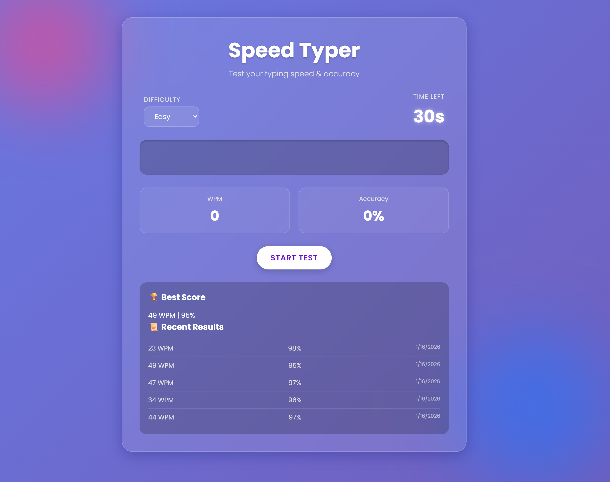

# ⚡ Speed Typer

A modern, glassmorphism-styled Typing Speed Test application to challenge your typing skills. Built with **HTML**, **CSS**, and **Vanilla JavaScript**.

👉 **[Live Demo Here 🚀](https://rimondipta.github.io/typing-speed-test/)**



## ✨ Features

- **Modern UI**: Beautiful Glassmorphism design with animated gradient backgrounds.
- **Time Challenge**: Race against the 30-second clock.
- **Real-time Stats**: Track your **WPM** (Words Per Minute) and **Accuracy** live.
- **Dynamic Difficulty**: Choose between **Easy**, **Medium**, and **Hard** modes.
- **Visual Feedback**: Instant color cues, shake animations on errors, and scrollable text for long quotes.
- **Auto-Save Scores**: Scores are automatically recorded when you finish the quote or run out of time.
- **Fully Responsive**: Works seamlessly on desktop and mobile with a balanced, scrollable layout.
- **Leaderboard**: LocalStorage-based high score tracking.

## 🚀 How to Play

1.  Select your difficulty level (Easy, Medium, Hard).
2.  Click **"Start Test"**.
3.  Type the displayed quote as fast and accurately as possible.
4.  The test ends **immediately** when you type the last character or when time runs out.
5.  Check the leaderboard to see your best scores!

## 🛠️ Installation

Simply clone the repository and open `index.html` in your browser.

```bash
git clone https://github.com/RimonDipta/typing-speed-test.git
cd typing-speed-test
# Open index.html
```

## 💻 Tech Stack

- **HTML5**
- **CSS3** (Animations, Flexbox, Glassmorphism, Custom Scrollbars)
- **JavaScript** (ES6+, LocalStorage, Event Handling)

---

_Made with ❤️ by Rimon_
