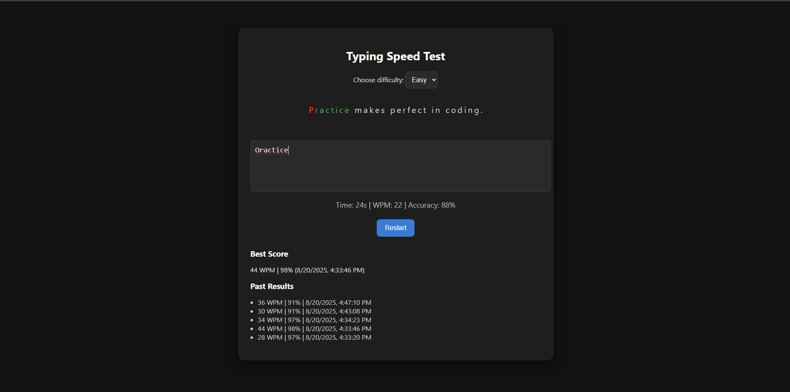

# ⌨️ Typing Speed Test Game

A fun and interactive **Typing Speed Test Game** built with **HTML, CSS, and JavaScript**.  
Challenge yourself, track your typing speed, and improve your accuracy!

👉 **[Live Demo Here 🚀](https://rimondipta.github.io/typing-speed-test/)**



---

## 🚀 Features

- 🎯 **Typing Practice** – Type random sentences with live feedback.
- ⏱ **Timer** – 30-second countdown with auto-finish.
- 📊 **Live Stats** – Real-time **WPM** (words per minute) and **accuracy** updates.
- ❌ **Mistake Highlighting** – Instantly see typing errors.
- 🎮 **Difficulty Levels** – Easy and Hard quote modes.
- 🔁 **Restart Option** – Restart test anytime with smooth animations.
- 🏆 **Leaderboard** – Tracks **best score** + last 5 results (saved in LocalStorage).
- 🌙 **Dark Mode UI** – Modern, minimal dark theme for better readability.

---

## 🛠️ Tech Stack

- **HTML5** – Structure
- **CSS3** – Responsive dark theme styling
- **Vanilla JavaScript** – Game logic, DOM manipulation, LocalStorage

---

## 📂 Project Setup

### 1. Clone the repository

```bash
git clone https://github.com/RimonDipta/typing-speed-test.git
```
